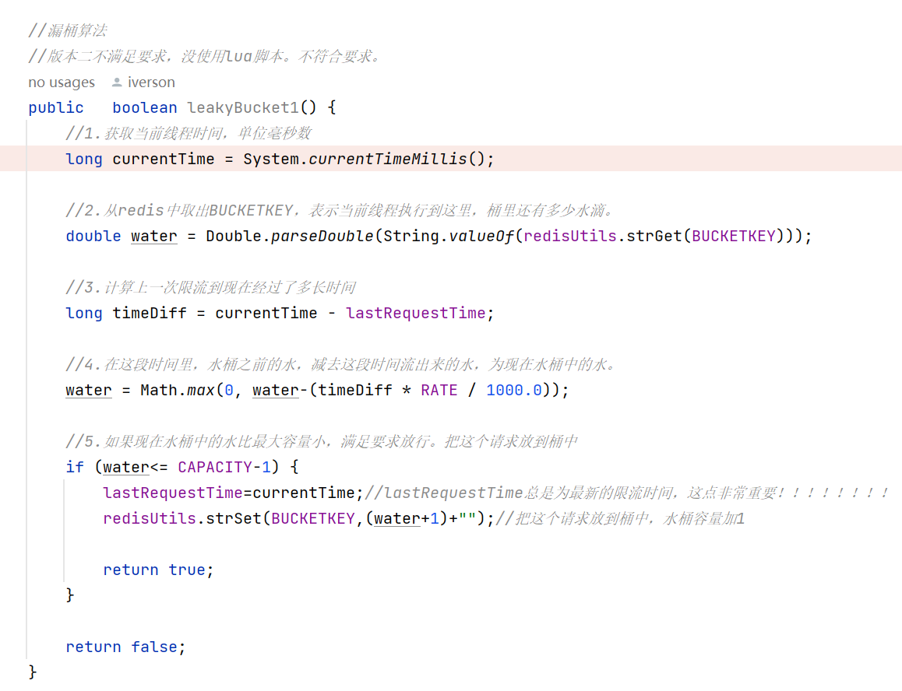
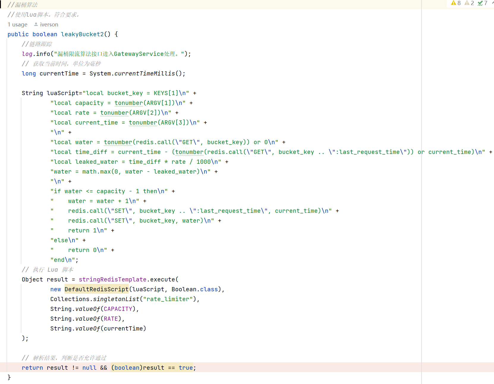
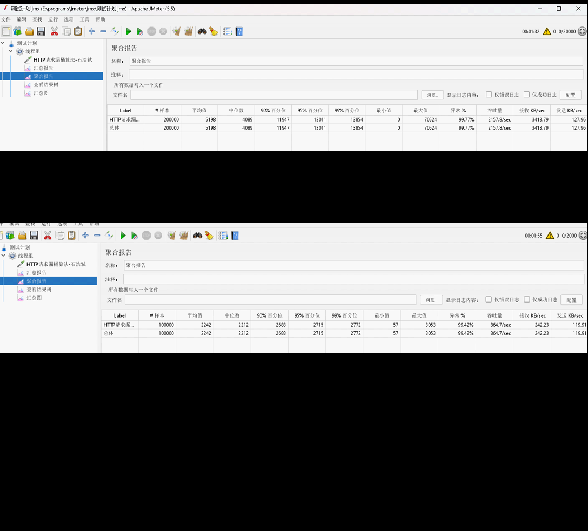
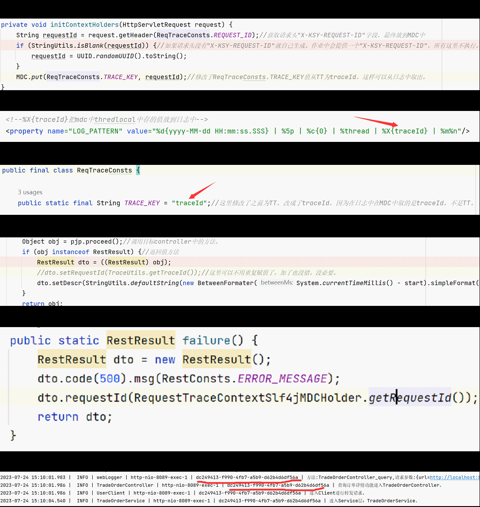

5.基于Redis实现漏桶限流算法

  先按照以上思路，当程序运行到leakyBucket1时，先获取当前线程时间，第二步从redis中取出water的值，表示上次水桶水量，
计算上一次限流到现在经过了多长时间，这里的lastRequestTime是上次限流的时间，如果没有限流的时候是不会更新lastRequestTime值，
第四步计算上次限流到现在水桶还剩的水，如果上次限流到现在时间很长可能会水桶漏完，但是不可能为负数，所以使用max（），如果第五步
if判断成功，表示现在水桶还没满，就放行请求，把请求丢到水桶里，水桶水容量+1，返回赋值lastRequestTime，当if判断失败直接返回false，
表示限流，这里不更新lastRequestTime。

  实际使用rua脚本执行。上述方法改写成rua脚本如下。

以下是jmeter测试结果：

第一个可以看出，从图中可以看出，一共20w条请求，异常为99.77%，正确请求条数为：200000*(1-99.77)%=460,发送这么多请求一共执行了92秒，
平均每秒执行：460/92=5条，也就是qps为5。满足要求。

第二个看出，再测试10w条，异常为99.42%，正确请求条数为：100000*(1-99.42)%=580,发送这么多请求一共执行了115秒，
平均每秒执行：580/115=5.04条，也就是qps为5.04。满足要求。

6.链路追踪。
首先程序最开始到过滤器中，在Slf4jMDCServletFilter类执行initContextHolders方法。在这个方法中会尝试获取请求头中"X-KSY-REQUEST-ID"字段
的值 ，并把这个值存在MDC中。但是在MDC中存的是key为“TT”，而后面取的时候使用的key为“traceId“，这就造成在日志中取不到这个值。解决方法直接在
ReqTraceConsts类中全局常量TRACE_KEY从“TT”替换为“"traceId"。接着分析链路追踪具体流程，在过滤器执行完了就执行WebLogAdvice类中环绕通知。
在调用目标方法的时候，最后返回的RestResult对象自动给requestId赋值为MDC中key为traceId的值。调用方法结束后RestResult就含有rquestId的值了。
所以注释的一行这里再次设置就没必要了，因为之前在过滤器已经设置MDC的key为traceId了。当前不注释执行也没错。最后在每个调用链中添加日志就可以附带
traceId进行日志追踪。最终得到链路追踪结果。
